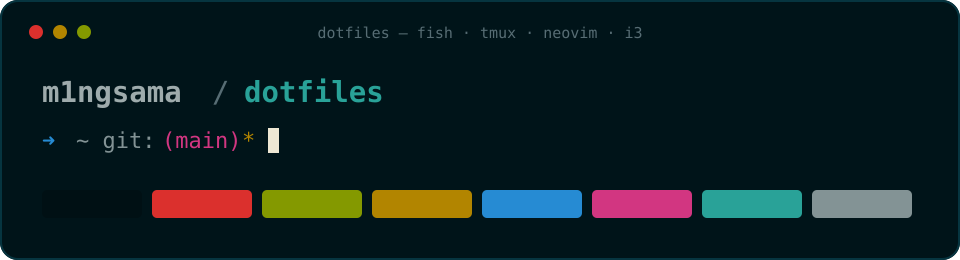

<p align="center">
  
</p>

# m1ngsama's dotfiles

> 工欲善其事，必先利其器。

A keyboard-first Solarized Osaka setup for Neovim, tmux, Fish, Alacritty,
and a minimal i3/X11 rice. This repository stores reviewed desired state—not a
snapshot of one machine.

> [!WARNING]
> These are personal workstation defaults. Do not apply them blindly.
> Bootstrap previews first and writes only with `--apply`; review the diff and
> keep its backup until the new setup has survived a full login.

## What's inside

| Area | Stack | Character |
| --- | --- | --- |
| Editor | Neovim 0.12, LazyVim, Mason, Tree-sitter | Exact 50-plugin lock, LSP and formatting |
| Shell | Fish, nvm.fish, optional eza/zoxide/ghq/fzf | Fast startup with guarded integrations |
| Multiplexer | tmux | `Ctrl-T` prefix, vi navigation, guarded lazygit popup |
| Terminal | Alacritty, ranger | True color, portable previews |
| Desktop | i3, Picom, rofi | Small X11 rice, 2 px focus borders, optional wallpaper |
| Management | chezmoi and repository scripts | Preview, backup, rollback, restore, verification |

The palette is locked to
[Solarized Osaka](https://github.com/craftzdog/solarized-osaka.nvim), with
restrained background transparency and explicit non-color error markers.
JetBrainsMono Nerd Font Mono is preferred; DejaVu Sans Mono and `monospace`
remain usable fallbacks.

## Support

| Profile | Status | Managed scope |
| --- | --- | --- |
| Linux core | Tier 1 | Fish, Neovim, tmux, Alacritty, ranger |
| macOS core | Tier 1 | Fish, Neovim, tmux, Alacritty, ranger |
| Linux X11 | Tier 1 | i3, Picom, Xresources, Xmodmap, X startup |
| Windows | Auxiliary | Caps-to-Control registry file, manual only |
| Wayland | Planned | A future, separate Sway profile |

Current minimums are Fish 3.6+, Neovim 0.12.0+, tmux 3.2+, chezmoi 2.72.0+,
and i3 4.22+ for X11. The source state targets `$HOME/.config`; a non-default
`$XDG_CONFIG_HOME` is not yet part of the support contract.

### Ranger preview tools

Ranger keeps a small `rc.conf` and a tracked preview script. Core navigation
needs only `ranger` and `file`; the optional media paths are guarded and enable
themselves when their commands are installed:

| Capability | Optional commands |
| --- | --- |
| Images and font previews | `chafa`, ImageMagick, `fontimage`, `exiftool` |
| Video thumbnails and metadata | `ffmpegthumbnailer`, `mediainfo` |
| PDF image/text previews | Poppler (`pdftoppm`, `pdftotext`) or MuPDF |
| Source and structured text | `bat`, `highlight`, Pygments, `jq` |
| Archives | `atool`, `bsdtar`, `unrar`, `7z` |
| Recoverable deletion bindings | `trash-put`, `trash-restore` from trash-cli |

Package names vary by operating system. The managed default keeps ranger's
graphical image mode disabled and uses `chafa` for portable terminal previews.
Set `preview_images` and `preview_images_method` locally only after selecting a
renderer supported by the active terminal.

## Install

### 1. Clone

```sh
git clone https://github.com/m1ngsama/dotfiles.git
cd dotfiles
```

### 2. Install the pinned chezmoi

Use an existing chezmoi 2.72.0+, or install the repository-pinned binary
without executing a remote shell:

```sh
./scripts/install-chezmoi
```

The installer supports macOS/Linux on amd64/arm64, verifies a static SHA-256,
and refuses to replace another binary unless `--force` is explicit. Pass the
verified path directly so another executable cannot shadow it:

```sh
./scripts/bootstrap --chezmoi "$HOME/.local/bin/chezmoi"
```

That command initializes the local chezmoi config and shows the target diff.
It does not write a managed dotfile.

### 3. Review, then apply

```sh
./scripts/bootstrap --chezmoi "$HOME/.local/bin/chezmoi" --apply
```

Existing targets prompt before replacement. For automation, force is a
separate authorization accepted only together with `--apply`:

```sh
./scripts/bootstrap --non-interactive --no-linux-x11 --apply --force
```

Linux prompts for the X11 profile. It can also be selected explicitly:

```sh
./scripts/bootstrap --linux-x11
./scripts/bootstrap --no-linux-x11
```

The first choice is persisted. On an existing chezmoi config, these flags
affect only the current run so local age, diff, edit, and data settings remain
byte-for-byte intact. Edit `data.profiles.linuxX11` in that config to make a
later change persistent.

Windows receives no chezmoi-managed target. Review and back up the affected
registry key before manually importing `keymap/capstoctrl.reg`.

### What bootstrap protects

- Every apply first backs up existing files, symlinks, and directory modes to
  `${XDG_STATE_HOME:-$HOME/.local/state}/dotfiles/backups`.
- Apply, verification, optional legacy cleanup, and signal handling form one
  transaction; failures restore that run automatically.
- A chezmoi config pointing to another repository is refused, not overwritten.
- Destination and backup paths reject unsafe symlink parent chains.
- No source directory is `exact_`, so unrelated local extensions and runtime
  state are not deleted.

## Daily workflow

The generated chezmoi config remembers this checkout as its source:

```sh
chezmoi diff
chezmoi apply --dry-run --verbose
./scripts/bootstrap --apply
chezmoi verify
```

Use bootstrap for writes when you want the repository's pre-apply backup.
Avoid `init --apply` on an existing home directory: a first-time target is not
protected by chezmoi's later conflict history.

### Keymap highlights

| Context | Keys | Action |
| --- | --- | --- |
| Fish | `Ctrl-G` | Pick a ghq repository with fzf, when both are installed |
| tmux | `Ctrl-T r` | Reload this tmux configuration |
| tmux | `Ctrl-T h/j/k/l` | Move between panes |
| tmux | `Ctrl-T \|` / `Ctrl-T -` | Split horizontally / vertically |
| tmux | `Ctrl-T g` | Open lazygit in a popup, when installed |
| Neovim | `ss` / `sv` | Split horizontally / vertically |
| Neovim | `sh/sj/sk/sl` | Move between windows |
| Neovim | `Space mp` | Toggle the in-editor Markdown preview |
| Neovim | `Space cs` | Toggle the Aerial symbols outline |
| i3 | `Super-Return` | Open the first available terminal |
| i3 | `Super-D` | Open rofi |
| i3 | `Super-j/k/l/;` | Focus left/down/up/right |

## Neovim setup

The editor graph is built on LazyVim, but both lazy.nvim and LazyVim bootstrap
at the exact commits recorded in `home/dot_config/nvim/lazy-lock.json`.
Project-local `.lazy.lua` specs and automatic update checks are disabled.

Basic editing can start while missing tools install asynchronously. For a
blocking, verifiable provision that returns non-zero on failure, close other
Neovim instances and run:

```sh
./scripts/setup-nvim
```

This command requires `git`, `curl`, a C compiler, `make`, `tar`/`unzip`,
Node.js with `npm`, and LuaRocks. It:

1. inspects every existing checkout before the real configuration starts;
2. preserves non-Git, modified, or mismatched plugins under
   `${XDG_DATA_HOME:-$HOME/.local/share}/nvim/dotfiles-quarantine`;
3. restores missing plugins from the reviewed lock without running old code;
4. waits for pinned Mason packages, configured LSP servers, and Tree-sitter
   parsers to finish; and
5. verifies receipts, source identities, versions, and repository commits.

One setup lock spans inspection and provisioning. If a hard crash leaves
`${XDG_STATE_HOME:-$HOME/.local/state}/nvim/dotfiles-setup.lock`, confirm no
setup or Neovim process is active before removing it.

Provisioning ignores personal/system Git hooks, templates, attributes,
filters, fsmonitor, and replacement refs. Standard environment variables such
as `HTTPS_PROXY` and `NO_PROXY` still work; do not depend on a personal Git
`insteadOf` or proxy rule for this command.

Mason uses the reviewed registry tag `2026-08-10-faulty-close`. Registry
updates remain explicit dependency reviews because transitive npm/LuaRocks
artifacts are not all bit-for-bit reproducible. Linux arm64 has no matching
registry asset for `clangd` or `selene`, so that profile expects a system
`clangd` and uses `luacheck` for Lua linting.

## Shell and terminal

Shell startup never downloads plugins and every optional integration is
guarded:

- `eza` enhances `l`, `ll`, `la`, `lg`, `lt`, and `all`; portable `ls`
  fallbacks remain available.
- `zoxide` supplies the `z` workflow when installed.
- `ghq` plus `fzf` enables the Fish `Ctrl-G` repository picker.
- `lazygit` enables the tmux `Ctrl-T g` popup.
- `lolcat` and `thefuck` affect presentation or convenience only.

Fish has no runtime plugin manager. The seven nvm.fish 2.2.17 files are an
intentional, checksummed vendor snapshot under `third_party/nvm.fish/`.
tmux has no TPM dependency and resolves its adjacent fragments relative to the
configuration file that was actually sourced.

## Linux/X11 rice

i3/X11 is the stable desktop path. Sway will be a separate profile rather
than an implicit behavioral replacement.

The full profile expects `rofi`, `feh`, `picom`, `dex`, `i3status`, `xss-lock`,
`i3lock`, NetworkManager's applet, and PulseAudio/PipeWire-compatible control
tools. Optional session helpers are guarded, and a missing wallpaper does not
prevent i3 from starting.

Wallpaper is host data, not shared configuration:

```sh
mkdir -p "${XDG_DATA_HOME:-$HOME/.local/share}/wallpapers"
ln -s /path/to/licensed-wallpaper \
  "${XDG_DATA_HOME:-$HOME/.local/share}/wallpapers/current"
```

Do not add artwork without recording its source, author, license, and
redistribution permission.

## Restore and migration

Every backup path is printed before apply. Restore is preview-first:

```sh
./scripts/restore /path/to/backup
./scripts/restore --apply /path/to/backup
```

The apply form restores files, symlinks, and original directory modes. Files
first created at paths recorded as absent remain unless removal is separately
authorized:

```sh
./scripts/restore --apply --remove-created /path/to/backup
```

> [!CAUTION]
> `--remove-created` removes the current regular file or symlink at every
> recorded-absent path even if it changed after apply. Inspect its preview
> immediately before use. Restore never removes directories.

### Upgrading the old Fish layout

The pre-chezmoi repository expanded Fisher, z, fish-exa, and fish-ghq directly
into `~/.config/fish`. Bootstrap detects the 96 retired repository paths and
leaves them alone by default. Back up and remove only that reviewed set with:

```sh
./scripts/bootstrap --apply --force --clean-legacy
```

Legacy cleanup is part of the same rollback transaction. Mutable
`fish_variables` is never removed automatically; inspect universal variables
with `fish -c 'set --names --universal'` and erase only values you recognize.

<details>
<summary>Source-state map</summary>

Only `home/` is interpreted as chezmoi source state. Infrastructure, licenses,
Windows registry files, and provenance remain outside it.

| Source | Target |
| --- | --- |
| `home/dot_config/fish/` | `$HOME/.config/fish/` |
| `home/dot_config/nvim/` | `$HOME/.config/nvim/` |
| `home/dot_config/tmux/` | `$HOME/.config/tmux/` |
| `home/dot_config/alacritty/` | `$HOME/.config/alacritty/` |
| `home/dot_config/ranger/rc.conf` | `$HOME/.config/ranger/rc.conf` |
| `home/dot_config/ranger/executable_scope.sh` | `$HOME/.config/ranger/scope.sh` |
| `home/dot_config/i3/config` | `$HOME/.config/i3/config` (Linux X11) |
| `home/dot_config/picom/picom.conf` | `$HOME/.config/picom/picom.conf` (Linux X11) |
| `home/dot_Xresources` | `$HOME/.Xresources` (Linux X11) |
| `home/dot_Xmodmap` | `$HOME/.Xmodmap` (Linux X11) |
| `home/dot_xprofile` | `$HOME/.xprofile` (Linux X11) |
| `home/executable_dot_xinitrc` | `$HOME/.xinitrc` (Linux X11) |

</details>

## Visual system and provenance

`theme/solarized-osaka.toml` is the palette source of truth. Its revision must
match the locked Neovim theme. Alacritty, tmux, Fish, and i3 use static,
reviewable fragments, so startup does not generate theme files or contact a
network. Checks enforce every mapped color and the key WCAG contrast pairs.

Alacritty alone blends its background at 0.9 opacity; Picom does not fade
glyphs or whole windows. Red is reserved for failure/urgent states, Fish keeps
a non-color exit marker, and i3 uses 2 px focus borders.

Vendored or derived work keeps exact upstream revisions, checksums, changes,
and licenses under `third_party/`, including nvm.fish, ranger's scope script,
the HSL helper, and Solarized Osaka.

## Performance

Capture a controlled local startup baseline:

```sh
./scripts/benchmark
./scripts/benchmark --nvim-data /path/to/isolated/xdg-data/nvim
```

The benchmark requires Python 3, Fish, and Git; Neovim is optional.

The default run uses a temporary HOME and XDG tree, sanitized Git settings,
five untimed warm-ups, and 100 measured samples each for unconfigured
interactive Fish core startup, configured interactive Fish startup, one prompt
render outside Git, one prompt render in a small local Git repository, and one
prompt render in a generated repository with 5,000 tracked files.
Configured Fish remains a host measurement: active optional integrations are
reported and included. The result records the commit, worktree state,
operating system, CPU, memory, runtimes, load average, sample count, min, p50,
p95, p99, and max. Explicit smaller sample counts omit tail percentiles they
cannot support.

Warm Neovim startup is opt-in. Pass a dedicated, already-provisioned
`stdpath("data")` directory; the benchmark copies it into the temporary tree,
verifies all locked plugin checkouts, disables missing-plugin, Mason, and
Treesitter provisioning in the copied runtime, and leaves the source untouched.
Its practical 30-sample default reports min, p50, and max. Use
`--nvim-samples 100` when a tail-percentile run is worth the extra time.

These numbers are observational baselines, not universal CI budgets. Compare
them on similar hardware with comparable power, thermal, and load conditions,
then investigate a repeatable regression before changing configuration.

## Validation

Run the same entry point used by CI:

```sh
./scripts/check
DOTFILES_CHECK_STRICT=1 ./scripts/check
DOTFILES_CHECK_NETWORK=1 DOTFILES_CHECK_STRICT=1 ./scripts/check
DOTFILES_CHECK_NETWORK=1 DOTFILES_CHECK_NVIM_FULL=1 \
  DOTFILES_CHECK_STRICT=1 ./scripts/check
```

The suite covers Shell/Fish/Lua/JSON/TOML syntax, formatting, ShellCheck,
personal-path leakage, Neovim APIs and locks, tmux/i3 parsing, full-tree
whitespace, provenance checksums, temporary-home chezmoi migration/rollback,
and signal/path safety. Full network mode additionally performs a clean-XDG
Neovim start, waits for the pinned toolchain, verifies all 50 repository HEADs,
and exercises cold Git isolation plus warm drift quarantine.

GitHub Actions installs a checksummed Neovim 0.12.4 and runs the core profile
on Linux and macOS. Pull requests use the fast offline path. Updates to `main`
and manual runs also exercise network provisioning, with the full Neovim cold
start on Linux. Superseded runs are cancelled automatically.

Performance measurements remain local and opt-in; CI validates behavior but
does not apply hardware-dependent startup thresholds.

## Maintenance

1. Keep configuration, runtime state, secrets, dependencies, and visual assets
   separate.
2. Keep optional integrations conditional; core startup must remain useful
   without them.
3. Pin or vendor downloaded configuration dependencies with provenance and
   license information.
4. Upgrade in reviewable batches and test in a clean home. Stable startup never
   auto-updates.
5. Preserve the visual identity through one palette and explicit variants,
   not host-specific edits.

The portable core, chezmoi migration, locked visual system, and dependency
canaries are complete. Future work stays practical: continued real-machine
validation, licensed screenshots, and explicit opaque/high-contrast variants.

## Credits

- [craftzdog/solarized-osaka.nvim](https://github.com/craftzdog/solarized-osaka.nvim)
  for the palette that defines this rice.
- [craftzdog/dotfiles-public](https://github.com/craftzdog/dotfiles-public)
  for the visual-first README inspiration. No screenshots or configuration are
  copied from that repository.

## License

Repository-authored configuration, scripts, and the palette preview are
licensed under [MIT](LICENSE). Vendored code retains the license recorded
beside its provenance metadata.
